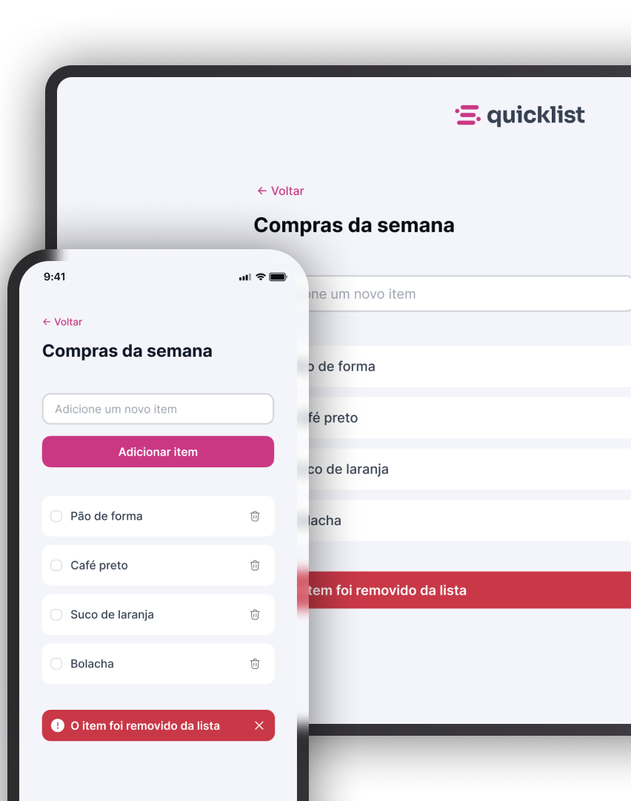

<h1 align="center">QuickList</h1>

  

## 📖 Sobre

O **QuickList** é uma aplicação web de lista de compras desenvolvida durante a Formação Full Stack da Rocketseat.

A aplicação permite que o usuário organize os produtos que precisa comprar, adicionando novos itens, definindo suas quantidades e marcando aqueles que já foram adquiridos.

Além da proposta original do projeto, foram implementadas funcionalidades adicionais para tornar a aplicação mais completa, como persistência dos dados utilizando `localStorage`, controle de quantidade, ordenação automática dos itens concluídos, remoção individual ou completa da lista e animações durante as interações.

O projeto foi desenvolvido com foco na prática de **JavaScript**, trabalhando principalmente com manipulação do DOM, eventos, arrays, objetos, funções, armazenamento local e atualização dinâmica da interface.

## 🚀 Tecnologias

- HTML5
- CSS3
- JavaScript
- Flexbox
- CSS Grid
- CSS Nesting
- Media Queries
- DOM
- Eventos JavaScript
- LocalStorage
- JSON
- Google Fonts

## ✨ Funcionalidades

- Adição dinâmica de novos itens à lista;
- Remoção individual de itens;
- Botão para limpar toda a lista;
- Persistência dos itens utilizando `localStorage`;
- Recuperação automática da lista ao acessar novamente a aplicação;
- Checkbox para marcar produtos já adquiridos;
- Persistência do estado dos checkboxes;
- Movimentação automática dos itens marcados para o final da lista;
- Manutenção da ordem dos itens após recarregar a página;
- Controle de quantidade de cada produto;
- Botões para aumentar e diminuir a quantidade;
- Edição manual da quantidade através de um campo numérico;
- Validação para impedir quantidades menores que 1;
- Validação para permitir somente quantidades inteiras;
- Persistência da quantidade de cada produto;
- Formatação automática da primeira letra do produto para maiúscula;
- Alerta visual após a remoção de um item;
- Fechamento automático ou manual do alerta;
- Animação de entrada e saída do alerta;
- Animação ao adicionar novos itens;
- Layout responsivo para dispositivos móveis e desktop.

## 🧠 Conceitos de JavaScript praticados

Durante o desenvolvimento foram utilizados diferentes conceitos fundamentais de JavaScript:

- Declaração de constantes e variáveis;
- Seleção de elementos com `querySelector()` e `getElementById()`;
- Manipulação de eventos com `addEventListener()`;
- Evento de envio de formulário;
- `preventDefault()`;
- Arrow Functions;
- Funções;
- Parâmetros de funções;
- Arrays;
- Objetos;
- Manipulação de arrays com `push()`;
- Manipulação de arrays com `splice()`;
- Busca de elementos com `indexOf()`;
- Iteração de arrays com `forEach()`;
- Manipulação do DOM com `createElement()`;
- Inserção de elementos com `append()`;
- Remoção de elementos com `remove()`;
- Manipulação de conteúdo com `textContent`;
- Manipulação de valores com `value`;
- Manipulação de classes com `classList`;
- Estruturas condicionais com `if` e `else`;
- Operadores lógicos;
- Conversão de valores com `Number()`;
- Validação de números com `Number.isInteger()`;
- Armazenamento de dados com `localStorage`;
- Conversão de objetos para JSON com `JSON.stringify()`;
- Conversão de JSON para objetos JavaScript com `JSON.parse()`;
- Temporizadores com `setTimeout()`;
- Cancelamento de temporizadores com `clearTimeout()`;
- Manipulação do estado de checkboxes;
- Criação dinâmica de identificadores para elementos.

## 🎨 Interface

A interface foi desenvolvida seguindo a proposta visual do **QuickList**, com um layout limpo, responsivo e focado na facilidade de uso.

Entre os elementos estilizados estão:

- Campo para adicionar novos produtos;
- Botão principal para adicionar itens;
- Cards individuais para cada produto;
- Checkbox personalizado;
- Controles de quantidade com botões de aumentar e diminuir;
- Campo editável para quantidade;
- Botão individual para remover produtos;
- Botão para limpar toda a lista;
- Alerta visual para itens removidos;
- Ícones em SVG;
- Animações de entrada e saída;
- Organização diferenciada dos controles de quantidade em dispositivos móveis;
- Itens concluídos posicionados automaticamente no final da lista;
- Layout desenvolvido utilizando abordagem Mobile First.

## 📁 Estrutura de pastas

- `index.html` — estrutura principal da aplicação
- `scripts.js` — lógica da lista, manipulação do DOM e armazenamento dos dados
- `assets/` — recursos visuais utilizados no projeto
  - `logo.svg` — logotipo da aplicação
  - `preview.png` — prévia do projeto
  - `icons/` — ícones utilizados na interface
- `styles/` — arquivos responsáveis pela estilização
  - `index.css` — arquivo principal responsável pela importação dos estilos
  - `global.css` — configurações globais, variáveis e tipografia
  - `header.css` — estilos do cabeçalho
  - `hero.css` — estilos da área principal, formulário e lista
  - `animation.css` — animações utilizadas na aplicação

## 💻 Projeto

[Acesse o projeto finalizado, online.](https://vkoithi.github.io/quicklist-market/)